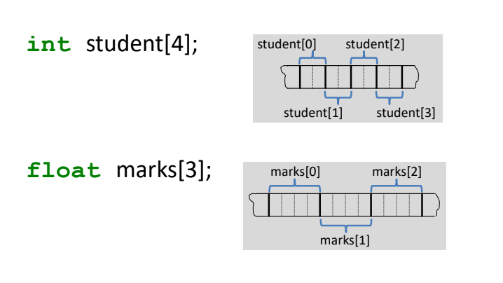

# Introduction - Arrays

- The Simplest but useful data structure
- Assign single name to a homogenous collection of instances of one abstract data type.
  - All array elements are of same type, so that a pre−defined equal amount of memory is allocated to each one of them.
- Individual elements in the collection have an associated index value that depends on array dimension.
- One-dimensional and two-dimensional arrays are commonly used.

# Memory Storage

## One Dimensional Array

It is stored in consecutive locations

## Two Dimensional Array

Can be visualized in the form of a matrix as

|       | Col 0       | Col 1       | Col 2       | Col 3       |
| ----- | ----------- | ----------- | ----------- | ----------- |
| Row 0 | marks[0][0] | marks[0][1] | marks[0][2] | marks[0][3] |
| Row 1 | marks[1][0] | marks[1][1] | marks[1][2] | marks[1][3] |
| Row 2 | marks[2][0] | marks[2][1] | marks[2][2] | marks[2][3] |

# Array Address Computation

## 1D array - address calculation

<Alert status="info" title="Formula for calculating Address">
  <Text>Address of A[i] = B + W * (i - LB)</Text>
  <Text color="gray.600">Where,</Text>
  <Text color="gray.600">B = Base Address</Text>
  <Text color="gray.600">W = Number of bytes used to store a singe array element</Text>
  <Text color="gray.600">i = subscript of element whose address is to be found</Text>
  <Text color="gray.600">LB = Lower limit (if not specified assume 0)</Text>
</Alert>

### Example - 1

Consider a 1D character array, where each character takes 1 byte of storage  
If the base address (B) = 1200 then,  
**Address of A[i] = B + W * (i - LB)**  
Address of A[0] = 1200 + 1 * (0 - 0) = 1200  
Address of A[1] = 1200 + 1 * (1 - 0) = 1201  
...  
Address of A[10] = 1200 + 1 * (10 - 0) = 1210  

### Example - 2

If LB = 5, Loc(A[LB]) = 1200, and W = 4 then find Loc(A[8])?  
Loc(A[8]) = Loc(A[5]) + 4 * (8 - 5) = 1212  
  